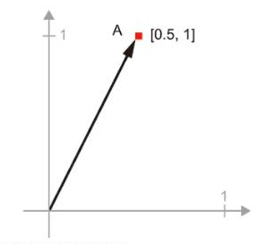
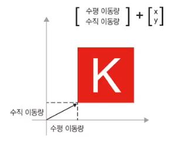
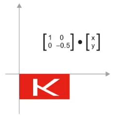
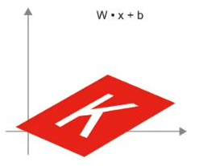
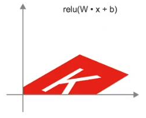
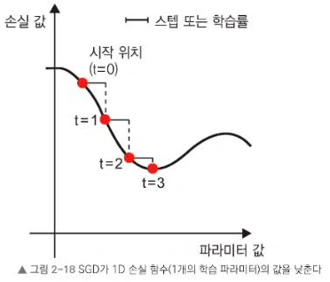
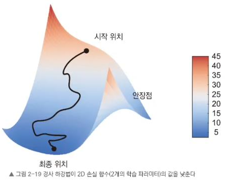

# **2장. 신경망의 수학적 구성 요소**
## **2.1 신경망과 첫 만남**

**Keras** 라이브러리를 사용해 손글씨 글자 분류를 하는 예제를 학습한다.

Traing Data로는 아래와 같은 **MNIST**(손글씨 데이터셋)를 사용한다. 

10개의 범주를 분류(0~9) (28x28 pixcels)   

머신러닝에서는 범주를 class라고 부른다.  즉, MNIST 데이터셋은 0부터 9까지 10개의 class가 있는 셈

  

# **2.2 신경망을 위한 데이터 표현**
- Tensor란 **tensor는 값의 배열의 집합을 의미한다.** 

- 보통은 3차원 부터 tensor라고 불리는데 scalar, vector, matrix도 값의 배열이기 때문에 tensor이다.
- 머신러닝에서 tensor의 차원(축) 수는 **Rank**라고 부른다. numpy.ndim()으로 확인, shape()으로 차원의 크기를 확인

## Rank

- Scalar(0-Rank tensor)
    하나의 숫자만 담고 있는 텐서를 스칼라(Scalar)라고 부른다. 0차원임.

- Vector(1-Rank tensor)
    1차원 배열을 벡터(vector)라고 함. 

    n개의 원소를 가지는 벡터를 n차원 백터라고도 부르기도 함. -> 하나의 원소가 하나의 feature로 해석해서 되어서 그런듯

    그래서 Rank와 n차원 벡터를 혼동하면 안댐 ㅇㅇ

- Matrix(Rank-2 tensor)

    벡터의 배열을 행렬(Matrix)라고 부른다. 테이블 형태의 데이터가 행렬 데이터에 해당함.
    Matrix데이터에서 일반적으로 행은 각각의 데이터 객체를 의미하며, 열은 데이터의 특징을 의미한다.

## batch란?
학습할 전체 데이터셋 나누어서 학습하는 것을 말한다.

전체데이터를 한번에 학습하는 경우 경우 즉 정말로 cost function의 값을 줄이는 양질의 이동을 하게 한다.
하지만 데이터셋의 크기가 커질 경우 iteration을 한번 수행하는데 소요되는 시간이 매우 길다. 이를 보완하기 위해서 learning rate를 높이려고 해봐도 쉽지 않다. 보통 학습을 진행 할 때 learning rate를 너무 크게 잡으면 local minimum만 왔다갔다하거나 minimum에 들어가지 못하는 shooting 현상이 생기기 때문. 

하드웨어입장에서 부담스럽다. 데이터셋이 커질 경우 그 데이터를 메모리에 올려야 될 뿐만 아니라 그 데이터의 전처리한 결과나 레이어를 거친 아웃풋 등도 수시로 메모리를 드나든다. 즉 매우 큰 메모리용량이 필요하다.

**따라서 적당히 빠르고 적당히 정확한 길을 찾기 위해 batch size를 사용해야 하며, 이를 mini-batch라고 한다.**

**1 Epoch : 모든 데이터 셋 한번 학습**
**1 iteration : mini-batch 1회 학습**

전체 데이터가 1000개, epochs = 20, batch size = 200로 학습한다고 가정하면
1 epoch에 5번의 iteration이 이루어진다 -> 1000 / 200 = 5

-> epoch은 20회 학습하면, iteration 100회 학습이 이루어짐.

데이터셋의 첫 번째 축(차원)을 **batch axis** 또는 **batch dimension**이라고 한다.

## 데이터셋

- 벡터 데이터 : (samples, features)로 구성된 랭크-2 텐서
- 시계열 데이터 또는 시퀀스 데이터 : (samples, timesteps, features) 크기의 랭크-3 텐서
- 이미지 : (samples, height, width, channels) 또는 (samples, channels, height, width)의 랭크-4 텐서. 이미지 픽셀들을 행렬로 보면 height가 행, width가 열이고 channels은 픽셀을 표현하는 정보들(색상,명암 등).
- 
- 동영상 : (samples, frames, height, width, channels)또는 (samples, frames, channels, height, width) 랭크-5 텐서. 하나의 이미지가 하나의 frame이라고 생각하면 됨.

  
# **2.3 신경망의 톱니바퀴 : 텐서 연산**
텐서 연산(operation) : 전치, 인덱싱, 슬라이싱, 선형 대수, 샘플링 등의 텐서를 다루는 연산을 모두 텐서 연산 또는 텐서 함수라고 한다.

Dense Layer : 입력 층과 출력 층을 모두 fully connected(fc)하게 연결된 형태를 Dense Layer라고 한다. 
입력층과 출력층이 서로 빽빽하게 연결되어 있어서 Dense라고 부른다.

    Dense(output_dim, input_dim, activation='relu')

    output = relu(dot(W, input) + b)
    * relu(x) = max(x, 0) -> 무조건 0 또는 양수로 만듬

 

## 원소별 연산
ReLU처럼 Numpy 배열의 연산을 필요로 할 때 Numpy 내장함수를 사용하는 것이 좋다.

Numpy는 내장함수는 BLAS라는 병렬화되고 효율적인 텐서 연산 라이브러리를 통해 일반적으로 여러 겹의 for문으로 작성된 함수보다 매우 빠르다.

Numpy에 내장된 연산함수에는 사칙연산, 행렬곱, 최대/최소값 등이 있다.

 

## 브로드캐스팅
작은 차원의 텐서가 큰 차원의 텐서의 크기에 맞추어 계산하는 것을 브로드캐스팅이라고 한다.

ex) Perceptron에서 입력이 벡터, 바이어스는 스칼라인 경우.

브로드 캐스팅이 일어나는 과정은 다음과 같다.

X.shape = (32, 10), y.shape = (10)
브로드 캐스팅을 하기 위해서는 X.shape[1] == y.shape[0]이 같아야 함.

1. 차원이 큰 텐서에 맞게 작은 텐서의 축이 추가된다. 
    np.expand_dims(y, axis=0) ---> y.shape = (1, 10)
2. 큰 텐서의 축에 맞게 작은 텐서를 반복
    np.concatenate([y] * 32, axis = 0) ---> y.shape = (32, 10)

 

## 행렬곱 성질
x.shape = (a, b), y.shape = (b, c)  x * y = z

=> z.shape = (a, c)     이때, x.shape[1] == y.shape[0]은 같아야 함.

 

## 텐서 변환
주로 텐서의 변환은 **크기변환(reshape 함수)이나 전치(transpose함수)**를 주로 사용한다. 크기변환은 전처리 단계, 전치행렬는 Backpropagation에서 가중치 행렬이 미분될때 shape을 맞춰주기 위해 쓰임.

images_data.shape = (60000, 28, 28)으로 있을 때

images_data.reshape((60000, 28 * 28))을 통해 60000개의 이미지를 크기 변환하면
Martix 형태로 표현된 이미지가 Vector 형태로 표현되게 됨.

 

## 텐서 연산의 기하학적 의미

 

텐서 형태의 값은 기하학적 공간에 있는 좌표로 해석 가능하다.

**이동** : 

벡터의 덧셈 

**회전** :

 R = [[cos(theta), -sin(theta)], [sin(theta), cos(theta)]]와 벡터의 내적. !
 
 [image](../assets/img/vector_spin.PNG)

**크기 변경** : 

S = [[horizontal, 0], [0, vertical]]와 벡터를 내적하여 얻는다. 

**선형 변환** : 

임의의 행렬과 내적하면 선형 변환이 수행됨. 회전과 크기변경이 선형변환에 해당함.

**아핀(affine) 변환** : 

선형 변환과 이동의 조합이다. Dense층에서 수행되는 y = W * x + b의 경우가 이에 해당함. 

relu 활성화 함수를 사용하는 Dense Layer : 아핀 변환에 ReLU 함수 적용. 

    activation function(활성화 함수)을 사용하는 이유가 여기 있다.

    dense layer에 activation function이 없다면, 오로지 아핀 변환만 이루어 지게 된다. 
    
    아무리 여러 층으로 아핀변환을 해봤자 결국 한번의 아핀변환과 같다. 
    
    따라서 활성화 함수를 통해 비선형적이고 기하학적인 변형을 가하여 풍부한 가설공간을  만들어 내야한다.

# **2.4 신경망의 엔진 : 그레디언트 기반 최적화**

    output = relu(dot(W, input) + b)

위와 같이 구성된 Dense Layer의 속성 W와 b는 가중치(weight) 또는 훈련되는 파라미터(trainable parameter)라고 부른다.

초기에는 가중치 행렬이 작은 난수로 채워져 있다(무작위 초기화:random initialization).
이러한 난수로 계산된 출력을 기반으로 파라미터가 점진적으로 조정되는데 이 과정을 훈련(training)이라고 부른다.

 

훈련은 다음과 같은 training loop을 가진다.
1. 훈련 샘플 x와 이에 상응하는 타깃 y_true의 배치를 추출한다. 
2. x를 사용하여 모델을 실행하고(foward pass), 예측값 y_pred를 구한다.
3. y_pred와 y_true의 차이를 측정하여 이 배치에 대한 모델의 손실을 계산한다. (cost function, loss function, objective function..)
4. 손실이 감소되도록 모델의 모든 가중치를 업데이트한다.

 

## 그레이디언트(gradient)

텐서의 도함수(미분함수)를 그레디언트라고 한다. y = w^2 + 3 같은 식에서 gradient는 곡선의 기울기 였다면, 다차원 텐서 함수의 gradient는 다차원 표면의 곡률을 의미한다.

    y = x * w + b
w에 대한 편미분을 통해, w변화에 따른 y(loss value) 증감을 알 수 있게된다. 

 

## 확률적 경사하강법(Stochastic Gradient Discent, SGD)

**경사 하강법**은 다음과 같은 과정을 거친다.
1. 훈련 샘플 x와 이에 상응하는 타깃 y_true의 배치를 추출한다. 
2. x를 사용하여 모델을 실행하고(정방향 계산), 예측값 y_pred를 구한다.
3. y_pred와 y_true의 차이를 측정하여 이 배치에 대한 모델의 손실을 계산한다. (cost function, loss function, objective function..)
4. 손실이 감소되도록 모델의 모든 가중치를 업데이트한다. (가중치의 업데이트는 설정한 Learning rate만큼 업데이트됨.)
5. 미분을 통해 모델의 파라미터에 대한 손실 함수의 gradient를 계산한다. (backward pass)
6. gradient의 반대 방향으로 파라미터를 W -= learing_rate * gradient만큼 이동시킨다.

여기서 확률적이라는 단어는 각 batch 데이터가 무작위로 샘플링 되는 것을 의미한다.

그림처럼 learning_rate 값을 적절하게 선택하는 것이 중요하다. 
값이 너무 작으면 곡선을 따라 내려가는 데 많은 반복이 필요하고 local minimum에 갇힐 수 있다. 
값이 너무 크면 손실 함수 global minimum에서 완전히 벗어난 위치로 이동할 수 있다.

(local minimum, global minimum은 뒤에서 설명)

**배치 경사 하강법(BGD)**
배치 경사 하강법은 **전체 데이터 셋**에 대한 에러를 구하여 Gradient를 한번만 계산하여 모델의 파라미터를 업데이트하는 방법을 의미한다. 학습이 안정적이지만 느리다.

이렇게 손실을 최소화하는 방법들을 **최적화 방법(Optimization method) 또는 옵티마이저(Optimizer)**라고 부른다.

Optimizer에는 SGD, Momentum, Adagrad(Adaptive Gradient Algorithm), RMSProp 등을 포함하여 여러 변형들이 있다.
이들의 특징 간략하게 소개하겠다.

SDG : learning_rate가 일정해서 매우 느리지만 안정적임.

Momentum : learing_rate에 관성의 개념이 추가되어 경사에 따라 학습률이 달라진다. 

Adagrad : 각각의 파라미터에 개별적으로 업데이트. 지속적으로 변화하던 파라미터는 최적값에 가까워 졌을 것이라고 간주하고, 한 번도 변하지 않은 파라미터에 더 큰 learing_rate을 부여함.

RMSProp : Adagrad의 문제점을 개선하기 위해 최소 학습률을 유지하여 학습속도가 0에 수렴하는 것을 방지한다.

이외에도 여러 Optimizer가 있으니까 찾아보도록

 

# **2.5 첫 번째 예제 다시 살펴보기**

# **2.6 요약**